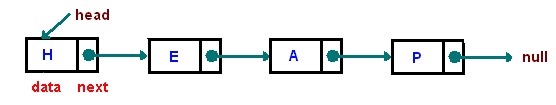
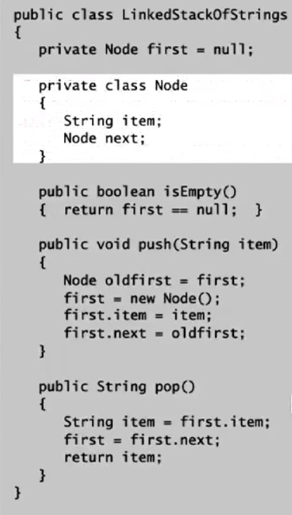

<h2>Stack</h2>

A stack is first in, first out (FIFO). We want to support the following operations:

- Push
- Pop
- isEmpty

We can implement a stack using a few different methods.

**LinkedList**

Recall that a linked list is a sequence of nodes where we store a head node with a next 
property that points to the next node in the list and so on...with the last node pointing 
to null.

To **push** an item onto the stack we:

- store a reference to the old first node
- add the new node at the head of the list
- point the new node to the “old” first node.

To **pop** an item from the list we:

- return the value of the head node
- have the head nodes "next" property become the new head node.

**isEmpty** just needs to check whether the head node has a value.

All operations on the linked list can be done in O(n) time complexity. 

Storing the linked list is O(n) space.

