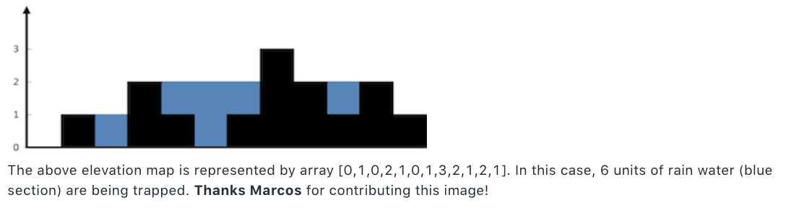

<h2>Trapping Rain Water</h2>

**Question**

Given n non-negative integers representing an elevation map where the width of each bar is 1, compute how much water it is able to trap after raining.

**Solution**

Each index has a certain amount of water that it can "store" above it.

We can calculate this number by:
1) Finding the highest bucket edge to the left
2) Finding the highest bucket edge to the right
3) Taking the minimum of these two numbers and subtracting the value of the current index.

To get the total amount of water captured we just keep adding the number derived from step 3
to a value initialized at the beginning of the solution.

Time Complexity: O(n^2)
Space Complexity: O(1)

**Solution 2**

- Perhaps we can memoize some calculations.

